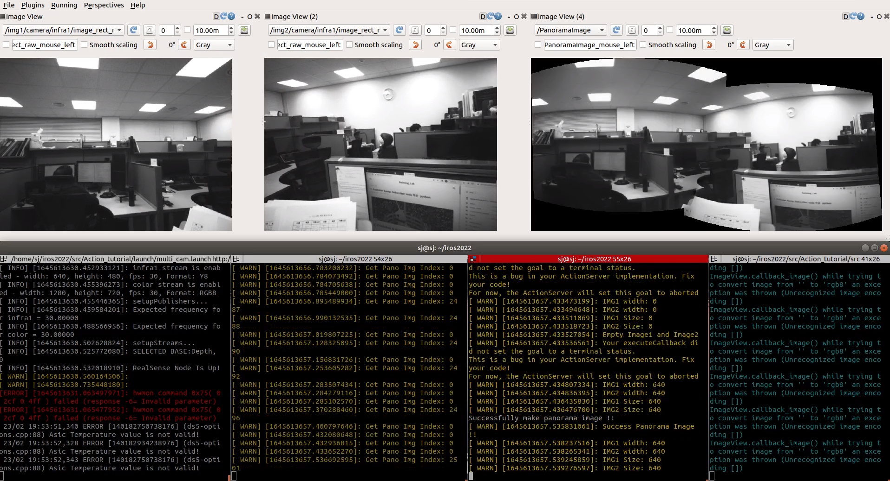

# Action Tutorial
## ROS에서 사용되는 action을 활용하여 client 와 server 사이 topic 을 주고 받아보기  



**Base Algorithm**
- [Image Stitching](https://github.com/SungJaeShin/Stitching_Image.git): Image stitching algorithm using OpenCV API.

**Basic Concept**
- [Action tutorial Kor](https://heathered-freon-621.notion.site/Action-Tutorial-Basic-concept-of-Action-53e29725788e4bff871bb4e6452f2b52): Explain basic concept of Action in KOR version.

**Description**
- Form: Class & Multi thread 
- Node: Client, Server
- Subscribe: Two Images of Realsense Camera 
- Publish: Panorama Image
- Action: 
    - Client: To give two images that have sensor_msgs::Image type and Index for Server
    - Server: To give Panorama image for Client using two images from Client

## 1. Prerequisites
### 1.1 **Ubuntu** and **ROS**
Ubuntu 64-bit 18.04.
ROS Melodic. [ROS Installation](http://wiki.ros.org/ROS/Installation)

### 1.2. **Action**
Follow [Actionlib](http://wiki.ros.org/actionlib#CA-01a90787f036b7f609402261d9a26d106ea379bb_1) \\
Follow [Action tutorials](http://wiki.ros.org/actionlib_tutorials/Tutorials).


### 1.3 **OpenCV Installation**
Follow [OpenCV](https://docs.opencv.org/4.x/d2/de6/tutorial_py_setup_in_ubuntu.html)
- Install appropriate OpenCV version: [Here](https://heathered-freon-621.notion.site/Opencv-How-to-install-appropriate-OpenCV-version-86275642fc924df5b1c258f077a94387).

### 1.4 **Intel RealSense ROS package and SDK**
Follow [realsense-ros](https://github.com/IntelRealSense/realsense-ros)

## 2. Build Action_tutorial
Clone the repository and catkin_make:
```
    $ cd ~/catkin_ws/src
    $ git clone https://github.com/SungJaeShin/Action_tutorial.git
    $ cd ../
    $ catkin build
    $ source ~/catkin_ws/devel/setup.bash    
```

## 3. Run two cameras and action
Open three terminals, run multi camera, client node, and server node respectively.
```
    $ roslaunch Action_tutorial multi_cam.launch
    $ rosrun Action_tutorial client 
    $ rosrun Action_tutorial server 
    $ (option) rqt_image_view 
```

## 4. Save panorama image in your PC
Change three variables "**save_pano_dir**" in makePanoramaImage function of server node !!
